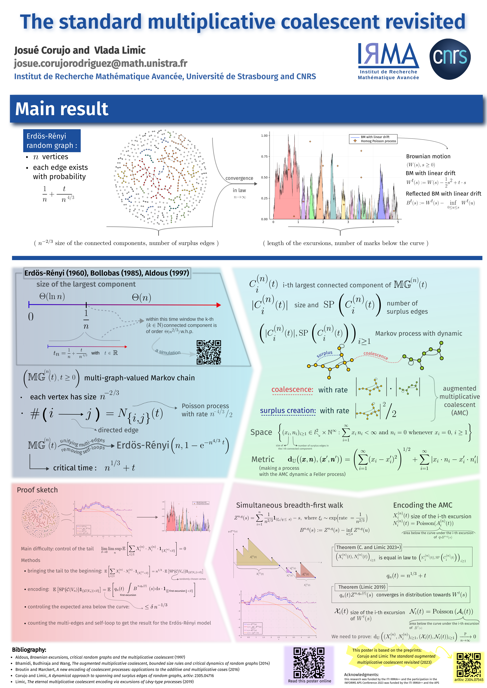

# Poster for APS Conference INFORMS at Nancy, France
SVG source for a poster presented at the [APS Conference INFORMS 2023](https://informs-aps2023.event.univ-lorraine.fr/) at Nancy, France.

This poster won one of the Best Poster Awards in the [APS Conference INFORMS 2023](https://informs-aps2023.event.univ-lorraine.fr/).

The poster was designed using Inkscape 1.2 and the svg file can be exported to pdf using the command
```console
inkscape poster.svg --export-filename=poster.png
```
For better visualisation in Inkscape, one needs to install the [Fira Sans Google familly font](https://fonts.google.com/specimen/Fira+Sans).

The design is inspired by those of [Dion Häfner](https://dionhaefner.github.io/2021/09/creating-a-better-science-conference-poster) and [Felix Breuer](http://blog.felixbreuer.net/2010/10/24/poster.html).

License Notice: You are welcome to use my poster as a template for your own work! Please make your poster available as a template as well. 
More formally: the poster is available under the [Creative Commons Attribution-ShareAlike 3.0 Unported License](https://creativecommons.org/licenses/by-sa/3.0/).


